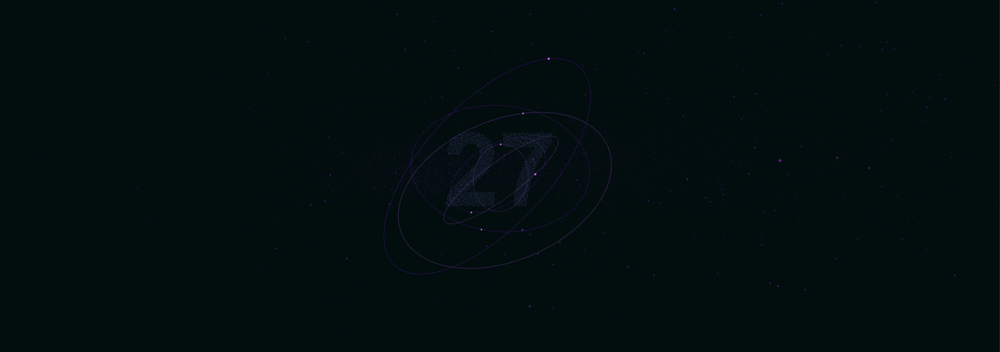

  
  
  
  
  

> I am a software developer driven by the belief that the true value of code lies in its accessibility. I provide the full source code for all my projects to support anyone looking to learn or build something new. Security is my primary focus, ensuring that every tool I release is fully protected and reliable. My goal is to transform creative concepts into practical, free software that simplifies daily tasks and solves real-world problems.

