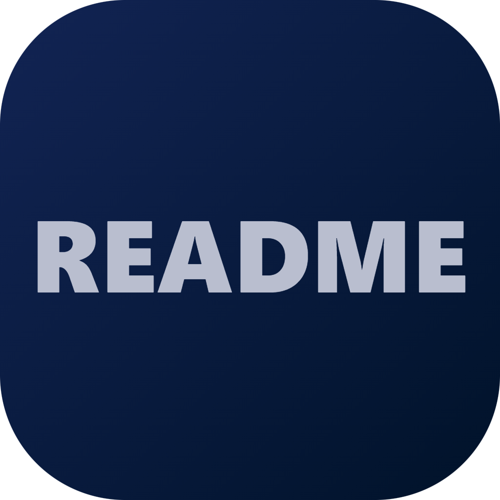

# Hi there, I'm Yasser 👋

  

## My Journey 

I started with **zero** knowledge of programming. I had never written a single line of code in my life. But I had a vision. I began leveraging AI as my co-pilot, learning day by day how to debug, fix syntax, and master the logic behind the brackets. Today, I spend days in front of my screen, turning "weird" ideas into **28+ functional tools**. I am a living proof that with AI and passion, anyone can become a creator.

---

## Tech & Tools

- **The Brain:** Prompt Engineering & AI Logic Orchestration.
- **Languages (Guided by AI):** Python, JavaScript, TypeScript, C++, Kotlin, HTML/CSS.
- **Specialties:** AI Code Editors (IDEs), Forensic Code Auditing, Desktop Productivity Tools.

---

## Featured Projects 

| Project | Showcase | Link |
| :--- | :--- | :--- |
| **Note-Studio-Ai**   AI-Native IDE focused on privacy and local LLMs. |  | [Explore Repo](https://github.com/YASSER-27/Note-Studio-Ai) |
| **Code-Auditor**   Forensic tool for detecting logic plagiarism. |  | [Explore Repo](https://github.com/YASSER-27/code-auditor) |
| **README-Builder**   Professional GUI tool for crafting READMEs. | | [Explore Repo](https://github.com/YASSER-27/README-Builder) |
| **OpenDoor**   Intelligent AI coding assistant with C++ core. |   | [Explore Repo](https://github.com/YASSER-27/opendoor) |

---
## My GitHub Activity & Metrics

  

  
  

  

---

## 📂 All Repositories (28+)

<b>Click to expand full project list</b>

 

* **gamanote** (JavaScript): desktop IDE and note-taking application.
* **code-auditor** (TypeScript): Forensic code auditing tool designed to detect logic plagiarism.
* **opendoor** (Python): AI coding assistant with a C++ core.
* **README-Builder** (Python): README Builder GUI.
* **README-Architect** (TypeScript): Specialized Markdown workspace for building high-quality READMEs.
* **Icon-Maker** (TypeScript): Fast icon creation tool.
* **Chrome-Pin** (Python): Tool that pins Chrome windows above all other apps.
* **Quran-Offline-Pc** (Python): Open-source Quran application with audio and text.
* **Note-Studio-Ai** (JavaScript): Lightweight, high-performance Code Editor with local AI capabilities.
* **page4all** (HTML): Welcome page HTML.
* **Short-Video-Style**: Watch personal videos in a style similar to YouTube/TikTok.
* **LLMs**: High-performance cross-platform desktop application for chatting with LLMs.
* **Empire-Capture**: High-performance screen and window recording tool.
* **Smart-Capture**: Easily capture specific windows or the entire screen.
* **Note-Studio** (JavaScript): Native desktop application for a seamless coding experience.
* **Fast-Scan-Folder** (Python): One-click folder scanner with report export features.
* **Home-move-server** (HTML): Home movie server for watching on phone, TV, or PC.
* **youtube-hd-video-download** (Python): Simple video downloader.
* **easy-run-gguf-model** (Python): App built using llama.cpp to run GGUF models.
* **Paste-Image-to-Download-final**: Fast clipboard image saving and screenshot tool.
* **Picture-in-Picture-google_chrome** (JavaScript): Picture-in-Picture extension for YouTube and other sites.
* **Paste-Image-to-Download** (Python): Fast image downloader from clipboard.
* **Ai-Server-LLM-Pc-and-Android** (Kotlin): Run llama.cpp from PC and Android devices.
* **Git-Uploader** (Python): Easy and fast Git uploader tool.
* **Ai-Image-creator** (Python): Simple AI image creation tool.
* **jump_game_html** (JavaScript): Small jumping game built with HTML, CSS, and JS.
* **Creat-Ai-image-on-phone** (Kotlin): Free AI image generator app for mobile.

---

## Support My Innovation 

I represent a new era of developers. I build at the speed of thought using AI. Your sponsorship helps me maintain my 28+ projects and continue exploring the boundaries of what a "non-coder" can achieve when empowered by technology.
